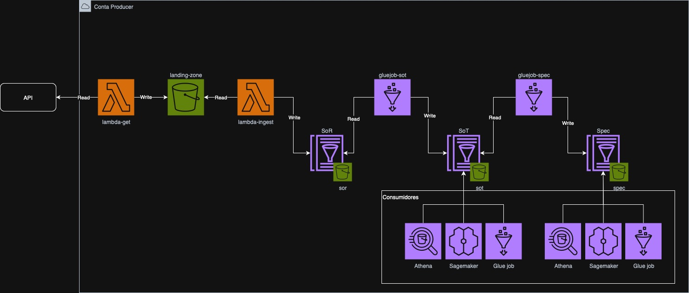
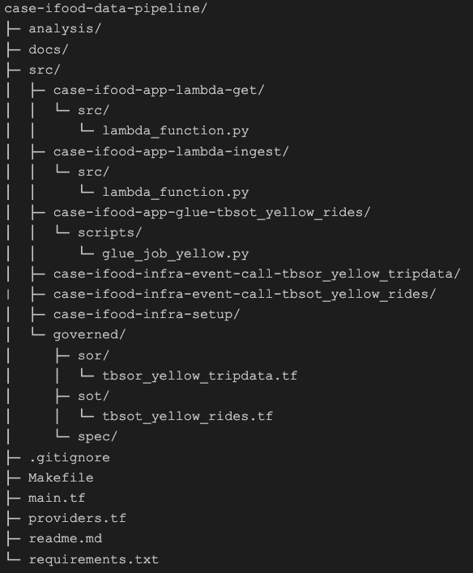

# Case iFood - Data Lake & Data Pipeline

Este repositório contém a implementação de um fluxo automatizado de aquisição, ingestão e processamento de dados públicos de corridas de táxi da cidade de Nova York, utilizando **AWS Lambda**, **AWS Glue** e **Amazon S3**.  

---

## 🎯 Proposta do Case

Criar um **workflow de processamento automatizado** que:

1. Realiza o download dos arquivos públicos de corridas de táxi de Nova York em um diretório de staging (**Landing**).  
2. Ingestão os arquivos na camada **SoR**.  
3. Cria uma visão tratada de corridas (**rides**) na camada **SoT**.  
4. Disponibiliza os dados para consultas SQL via **Athena** e para uso em **SageMaker** ou **Glue Jobs**.

> 🔎 Apesar de a camada **Spec** existir na arquitetura, ela **não será utilizada neste case**.

> A movimentação entre as camadas deve ser realizada através de eventos

---

## 🏗️ Arquitetura

A arquitetura da solução segue um **workflow de ingestão e transformação de dados** em múltiplas camadas, conforme o desenho abaixo:

1. **Aquisição de Dados (Lambda GET)**  
   Busca o dado de origem e pousa na **landing-zone** (S3).

2. **Ingestão (Lambda INGEST)**  
   Movimenta os dados da camada **Landing** para a camada **SoR**.

3. **Processamento (Glue Job)**  
   Lê os dados brutos da **SoR**, aplica tratamentos e gera a visão tratada em **SoT**.

4. **Camada Spec (opcional)**  
   Conceitualmente prevista para processamentos especializados, mas **não utilizada neste case**.

5. **Consumidores**  
   Dados da SoT podem ser consumidos por:
   - **Athena** (SQL Serverless para análise).
   - **SageMaker** (Machine Learning).
   - **Glue Jobs** (pipelines adicionais).

---

## 🗂️ Contexto das Camadas

- **SoR (System of Record)**  
  Camada de registro bruto, contendo os dados exatamente como recebidos da origem, sem alterações.  
  Exemplo: `tbsor_yellow_tripdata`.

- **SoT (System of Truth)**  
  Camada de verdade única, com dados tratados, padronizados e prontos para consumo corporativo.  
  Exemplo: `tbsot_yellow_rides`.

- **Spec (Specialized Processing Engines)**  
  Camada opcional destinada a processamentos especializados (modelos, cálculos específicos, métricas de negócio).  
  Neste **case**, a Spec está presente apenas conceitualmente.

---

## 📌 Estrutura do Repositório

---

## ⚙️ Componentes

### `case-ifood-infra-setup`
Infraestrutura inicial do Data Lake:
- Criação dos buckets no **S3**.
- Organização de diretórios (`landing`, `sor`, `sot`, `spec`).
- Criação da estrutura de Lake, contemplando as camadas SoR, SoT e Spec
- Criação de tabelas Glue Catalog (pasta governed), contemplando as modelagens utilizadas no case.

---

### `case-ifood-app-lambda-get`
Função Lambda responsável por:
- Fazer **download dos arquivos de origem** ([NYC Taxi Trip Data](https://www.nyc.gov/site/tlc/about/tlc-trip-record-data.page)).
- Pousar os arquivos brutos no bucket **landing-zone**.

---

### `case-ifood-app-lambda-ingest`
Função Lambda responsável por:
- Ler os arquivos da camada **landing**.
- Carregar os dados brutos no database **tbsor_yellow_tripdata** (SoR).

---

### `case-ifood-infra-event-call-tbsor_yellow_tripdata`
Configuração de evento no **S3**:
- Detecta quando um novo arquivo chega na **landing-zone**.
- Dispara automaticamente a execução da **lambda-ingest**.

---

### `case-ifood-app-glue-tbsor_yellow_tripdata`
Job do **AWS Glue** responsável por:
- Ler os dados da camada **SoR**.
- Aplicar transformações, filtros e seleção de colunas relevantes.
- Gravar o resultado na tabela **tbsot_yellow_rides** (SoT).

